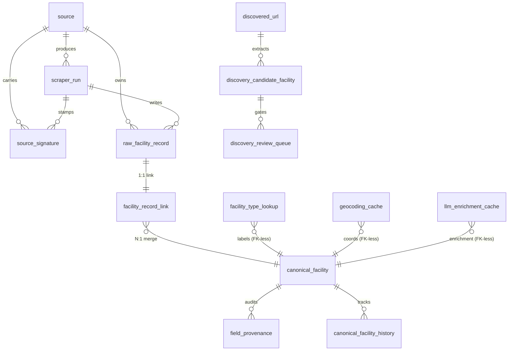

# Database Schema Reference

Complete schema documentation for the Arch Legacy Partners wastewater
facility database. Every table, every column, every constraint.

The schema lives in `supabase/migrations/`; this document mirrors what's
there. If they disagree, the migrations are authoritative.

Logical groups:

1. **Operational metadata** — `source`, `scraper_run`, `source_signature`
2. **Raw observations** — `raw_facility_record`
3. **Canonical entities** — `canonical_facility`, `facility_record_link`, `field_provenance`, `canonical_facility_history`
4. **Enrichment cache** — `geocoding_cache`, `llm_enrichment_cache`
5. **Discovery surface (Phase 4.5)** — `discovered_url`, `discovery_candidate_facility`, `discovery_review_queue`, `facility_type_lookup`
6. **Access layer** — 20 SQL Views over `canonical_facility`

## Entity-relationship diagram



Read it from top-left to bottom-right: a `source` produces scraper
runs; each run writes one row per observed facility into
`raw_facility_record`; the resolver merges raws into a `canonical_facility`
through `facility_record_link`; `field_provenance` audits every populated
canonical field back to its source raw row; the discovery surface is a
parallel pipeline for Phase 4.5 (Brave Search → Haiku extraction → human
review before promotion).

The three cache tables (`geocoding_cache`, `llm_enrichment_cache`,
`facility_type_lookup`) sit outside the FK graph by design — they're
addressed by hash or by symbolic key, not by row ID, so cache hits are
cheap and rebuilds are painless.

---

## 1. Operational metadata

### `source`

Registry of every place we pull data from. Each source has a stable
machine slug, a human-readable name, and a ToS / robots.txt audit
stamp that records what we're allowed to do. Seeded once via
`supabase/migrations/20260511203501_source_seed.sql`; new sources are
added by appending a follow-on migration, not by ad-hoc INSERT.

| Column | Type | NULL | Default | Notes |
|---|---|---|---|---|
| `id` | `BIGSERIAL` | NOT NULL | — | Primary key |
| `slug` | `TEXT` | NOT NULL | — | UNIQUE; machine key (e.g. `epa_echo`) |
| `name` | `TEXT` | NOT NULL | — | Human-readable display name |
| `type` | `TEXT` | NOT NULL | — | CHECK ∈ {`federal`, `state`, `county`, `discovery_crawl`, `operator_site`, `registry`} |
| `base_url` | `TEXT` | NULL | — | Source home URL; NULL for placeholder rows |
| `tos_url` | `TEXT` | NULL | — | URL to the ToS document (or closest equivalent) used in the audit |
| `tos_posture` | `TEXT` | NOT NULL | `'unknown'` | `permissive` \| `restrictive` \| `unknown` \| `declined` |
| `robots_txt_status` | `TEXT` | NOT NULL | `'unknown'` | `allow` \| `disallow` \| `none` \| `unknown` |
| `notes` | `TEXT` | NULL | — | Long-form audit notes (the audit itself lives in `docs/source_audit_phase0.md`) |
| `last_checked_at` | `TIMESTAMPTZ` | NULL | — | When the audit was last refreshed |
| `created_at` | `TIMESTAMPTZ` | NOT NULL | `NOW()` | Auto-populated |

**Indexes:** PRIMARY KEY (`id`), UNIQUE (`slug`).

### `scraper_run`

One row per scraper execution. The resolver's run IDs (Phase 3) and
the geocoder backfill's runs go here too — anything that touches
`raw_facility_record` or `source_signature` opens a `scraper_run`
first so the audit chain stays intact.

| Column | Type | NULL | Default | Notes |
|---|---|---|---|---|
| `id` | `BIGSERIAL` | NOT NULL | — | Primary key |
| `source_id` | `BIGINT` | NOT NULL | — | FK → `source(id)` ON DELETE RESTRICT |
| `started_at` | `TIMESTAMPTZ` | NOT NULL | `NOW()` | When the run began |
| `finished_at` | `TIMESTAMPTZ` | NULL | — | NULL while the run is `running`; populated when the run lands in a terminal state |
| `status` | `TEXT` | NOT NULL | `'running'` | CHECK ∈ {`running`, `success`, `failed`, `paused_drift`} |
| `rows_in` | `INTEGER` | NULL | — | How many rows the source emitted (before idempotency filter) |
| `rows_inserted` | `INTEGER` | NULL | — | Rows newly inserted into `raw_facility_record` this run |
| `rows_updated` | `INTEGER` | NULL | — | Rows whose `payload_hash` changed (real updates only) |
| `error_message` | `TEXT` | NULL | — | Populated on `status='failed'` |

**Indexes:** `(source_id, started_at DESC)` for "latest-N-runs-per-source" queries.

### `source_signature`

Drift-detection baseline. Captures the per-run shape of the source's
output (HTTP status, byte size, schema hash, row count) so the
`orchestration/drift_detector.py` step can compare the latest
successful run against the previous successful run on the locked
decision 8.7 thresholds (HTTP non-200, row count drop >30%,
schema_hash mismatch, byte size delta >50%).

Federal loaders write **one consolidated signature per logical
refresh** even when the loader iterates multiple state slices (Phase 5
follow-on `9a6eb53`).

| Column | Type | NULL | Default | Notes |
|---|---|---|---|---|
| `id` | `BIGSERIAL` | NOT NULL | — | Primary key |
| `source_id` | `BIGINT` | NOT NULL | — | FK → `source(id)` ON DELETE CASCADE |
| `scraper_run_id` | `BIGINT` | NOT NULL | — | FK → `scraper_run(id)` ON DELETE CASCADE |
| `http_status` | `INTEGER` | NULL | — | HTTP status the source returned. NULL for manual-drop sources. |
| `response_byte_size` | `BIGINT` | NULL | — | Size of the response body (or manual-drop file) in bytes |
| `schema_hash` | `TEXT` | NULL | — | sha256 of the canonicalized column-set string. Stable across same-shape responses. |
| `row_count` | `INTEGER` | NULL | — | Total rows parsed from the source this run |
| `selectors_hit_count` | `INTEGER` | NULL | — | For scraper-on-HTML sources; how many CSS selectors matched |
| `last_modified` | `TEXT` | NULL | — | RFC 7231 Last-Modified header (or equivalent date parsed from source). Added in migration `20260511221000`. |
| `captured_at` | `TIMESTAMPTZ` | NOT NULL | `NOW()` | When the signature row was written |

**Indexes:** `(source_id, captured_at DESC)`.

---

## 2. Raw observations

### `raw_facility_record`

One row per observation from a source. **Never modified after insert**
except for the upsert path that bumps `scraper_run_id` + `ingested_at`
when a row's `payload_hash` changes. The upsert is hash-gated by a
WHERE clause inside ON CONFLICT, so re-runs of an unchanged source
flow through as zero updates.

| Column | Type | NULL | Default | Notes |
|---|---|---|---|---|
| `id` | `BIGSERIAL` | NOT NULL | — | Primary key |
| `source_id` | `BIGINT` | NOT NULL | — | FK → `source(id)` ON DELETE RESTRICT |
| `source_record_id` | `TEXT` | NOT NULL | — | Stable per-source key (NPDES, CWNS_ID, TCEQ Additional ID, NC `WQ\d{7}`, NC SW `Facility Id`, NC SF `Permit`). Format documented in `docs/build_log.md` → "Phase 3 prep → Stable identifier formats encountered". |
| `scraper_run_id` | `BIGINT` | NOT NULL | — | FK → `scraper_run(id)` ON DELETE RESTRICT |
| `raw_payload` | `JSONB` | NOT NULL | — | The full source row, as observed. Provenance is a separate relational table. |
| `payload_hash` | `TEXT` | NOT NULL | — | sha256 of the canonicalized JSON. Drives no-change detection on re-run. |
| `ingested_at` | `TIMESTAMPTZ` | NOT NULL | `NOW()` | Last time this row was upserted |

**Constraints:** UNIQUE (`source_id`, `source_record_id`) — the
idempotency hinge. Upsert via `ON CONFLICT (source_id,
source_record_id) DO UPDATE WHERE payload_hash <> EXCLUDED.payload_hash`.

**Indexes:** PRIMARY KEY (`id`), UNIQUE (`source_id`, `source_record_id`),
`(payload_hash)`, `(scraper_run_id)`.

---

## 3. Canonical entities

### `canonical_facility`

Resolved entity. **What `exports/facilities_primary.csv` reads.**
UUID-keyed (not BIGSERIAL) so the canonical ID is stable across CSV
exports and downstream consumer joins regardless of insert order.

Field merge policy is **first non-null wins** at the resolver layer
(`resolver/_canonicalize.py`); the resolver processes sources in a
locked order (CWNS → ECHO → TCEQ → NC ND → NC SW → NC SF) so the
most-trusted source anchors each field. The UPSERT in
`CANONICAL_INSERT_SQL` enforces this at the DB layer too via
`COALESCE(canonical_facility.<col>, EXCLUDED.<col>)`.

| Column | Type | NULL | Default | Notes |
|---|---|---|---|---|
| `id` | `UUID` | NOT NULL | `gen_random_uuid()` | Primary key. Minted in Python at canonical creation so the in-memory index can use it without a round-trip. |
| `name` | `TEXT` | NULL | — | Facility name (first non-null across linked raws) |
| `facility_type` | `TEXT` | NULL | — | One of 7 v1 category slugs (see `config/facility_types.yaml`) or NULL (out-of-scope or unclassified) |
| `street` | `TEXT` | NULL | — | Street-address line 1 |
| `city` | `TEXT` | NULL | — | City as-given |
| `state` | `TEXT` | NULL | — | USPS 2-letter code |
| `zip` | `TEXT` | NULL | — | ZIP or ZIP+4 |
| `county` | `TEXT` | NULL | — | County as-given |
| `latitude` | `DOUBLE PRECISION` | NULL | — | -90..90 by CHECK; per-state envelope check is application-layer (`orchestration/geocoder.py`) |
| `longitude` | `DOUBLE PRECISION` | NULL | — | -180..180 by CHECK |
| `accepts_septage` | `TEXT` | NULL | — | Tri-state: `Yes` \| `No` \| `Unknown`. Populated by Phase 4 enrichment. |
| `accepts_grease_trap` | `TEXT` | NULL | — | Tri-state, same shape as above |
| `accepts_portable_toilet` | `TEXT` | NULL | — | Tri-state, same shape as above |
| `pricing_notes` | `TEXT` | NULL | — | Free-form; populated by Phase 4 LLM extraction or manual edit |
| `phone` | `TEXT` | NULL | — | Contact phone |
| `email` | `CITEXT` | NULL | — | Case-insensitive email |
| `website` | `TEXT` | NULL | — | Operator/program website |
| `frs_id` | `TEXT` | NULL | — | EPA FRS Registry ID (federal cross-system identifier) |
| `npdes_id` | `TEXT` | NULL | — | NPDES permit number (`<state>\d{7}` shape; cross-source merge key) |
| `state_permit_id` | `TEXT` | NULL | — | Most-specific state-level permit ID (TCEQ Additional ID, NC `WQ\d{7}`, NC SW Facility Id, NC SF Permit) |
| `first_seen_at` | `TIMESTAMPTZ` | NOT NULL | `NOW()` | When this canonical first appeared in any resolver run |
| `last_seen_at` | `TIMESTAMPTZ` | NOT NULL | `NOW()` | When this canonical was last touched (by any resolver run) |

**CHECK constraints (global by design, not per-state — forward-compat for new states):**

```sql
state                   ~ '^[A-Z]{2}$'  OR NULL
accepts_septage         ∈ ('Yes','No','Unknown') OR NULL
accepts_grease_trap     ∈ ('Yes','No','Unknown') OR NULL
accepts_portable_toilet ∈ ('Yes','No','Unknown') OR NULL
latitude                BETWEEN -90  AND 90       OR NULL
longitude               BETWEEN -180 AND 180      OR NULL
```

**Indexes:** PRIMARY KEY (`id`); `(state, facility_type)`;
`(state, county)`; partial `(frs_id) WHERE frs_id IS NOT NULL`;
partial `(npdes_id) WHERE npdes_id IS NOT NULL`; partial
`(state_permit_id) WHERE state_permit_id IS NOT NULL`.

### `facility_record_link`

Many raw observations → one canonical entity. UNIQUE on
`raw_facility_record_id` enforces one canonical per raw.

| Column | Type | NULL | Default | Notes |
|---|---|---|---|---|
| `id` | `BIGSERIAL` | NOT NULL | — | Primary key |
| `raw_facility_record_id` | `BIGINT` | NOT NULL | — | FK → `raw_facility_record(id)` ON DELETE CASCADE. UNIQUE — one canonical per raw. |
| `canonical_facility_id` | `UUID` | NOT NULL | — | FK → `canonical_facility(id)` ON DELETE CASCADE |
| `match_score` | `NUMERIC(5,2)` | NULL | — | 0.00–100.00 RapidFuzz score. NULL for `match_method='id_match'`. |
| `match_method` | `TEXT` | NOT NULL | — | CHECK ∈ {`id_match`, `rapidfuzz`, `manual`, `discovery_extract`} |
| `linked_at` | `TIMESTAMPTZ` | NOT NULL | `NOW()` | When the link was written |

**Indexes:** PRIMARY KEY (`id`); UNIQUE (`raw_facility_record_id`);
`(canonical_facility_id)`.

### `field_provenance`

Per-field provenance. One row per (canonical_facility_id, field_name,
observed_at). The `canonical_facility` row carries the current
("winning") value; this table holds the audit chain of every source-
attested value for every field.

| Column | Type | NULL | Default | Notes |
|---|---|---|---|---|
| `id` | `BIGSERIAL` | NOT NULL | — | Primary key |
| `canonical_facility_id` | `UUID` | NOT NULL | — | FK → `canonical_facility(id)` ON DELETE CASCADE |
| `field_name` | `TEXT` | NOT NULL | — | Canonical-row column name (`name`, `street`, `facility_type`, etc.) |
| `value` | `TEXT` | NULL | — | Text representation of the source-attested value |
| `source_url` | `TEXT` | NULL | — | URL to the source page/document |
| `source_date` | `TIMESTAMPTZ` | NULL | — | When the source last updated the value |
| `extraction_method` | `TEXT` | NOT NULL | — | CHECK ∈ {`direct_scrape`, `llm_extracted`, `manual`}. Phase 3 always writes `direct_scrape`. |
| `confidence` | `TEXT` | NOT NULL | — | CHECK ∈ {`high`, `medium`, `low`} |
| `observed_at` | `TIMESTAMPTZ` | NOT NULL | `NOW()` | When this provenance row was written |

**Indexes:** PRIMARY KEY (`id`);
`(canonical_facility_id, field_name, observed_at DESC)` —
"give me the latest provenance for this field" lookup; `(field_name)`.

### `canonical_facility_history`

Field-level audit of changes to `canonical_facility` over time.
**Schema present but the v1 resolver does not populate this table.**
Phase 4 enrichment is the first writer; until then this table is 0
rows and `canonical_history_recent.sql` in the query library returns
empty.

| Column | Type | NULL | Default | Notes |
|---|---|---|---|---|
| `id` | `BIGSERIAL` | NOT NULL | — | Primary key |
| `canonical_facility_id` | `UUID` | NOT NULL | — | FK → `canonical_facility(id)` ON DELETE CASCADE |
| `field_name` | `TEXT` | NOT NULL | — | The mutated field |
| `old_value` | `TEXT` | NULL | — | Pre-change text representation |
| `new_value` | `TEXT` | NULL | — | Post-change text representation |
| `changed_at` | `TIMESTAMPTZ` | NOT NULL | `NOW()` | When the mutation landed |
| `change_source` | `TEXT` | NOT NULL | — | `scraper_run:<id>` \| `manual:<user>` \| `resolver` |

**Indexes:** PRIMARY KEY (`id`);
`(canonical_facility_id, changed_at DESC)`.

---

## 4. Enrichment cache

### `geocoding_cache`

Address → coordinates cache. Keyed by sha256 of the **normalized**
input (trim, collapse whitespace, upper-case). The resolver pre-loads
this table at run start and uses it to enrich coord-less raws before
the 200m proximity tiebreak fires.

| Column | Type | NULL | Default | Notes |
|---|---|---|---|---|
| `address_hash` | `TEXT` | NOT NULL | — | PRIMARY KEY. sha256(normalized_input). |
| `normalized_input` | `TEXT` | NOT NULL | — | The one-line address as sent to the geocoder |
| `lat` | `DOUBLE PRECISION` | NULL | — | NULL on `confidence='failed'` |
| `lng` | `DOUBLE PRECISION` | NULL | — | NULL on `confidence='failed'` |
| `confidence` | `TEXT` | NOT NULL | — | CHECK ∈ {`high`, `medium`, `low`, `failed`} |
| `matched_address` | `TEXT` | NULL | — | What Census Geocoder echoed back |
| `geocoded_at` | `TIMESTAMPTZ` | NOT NULL | `NOW()` | When the lookup ran |

### `llm_enrichment_cache`

Anthropic Haiku response cache for Phase 4 enrichment. Keyed by
content-hash + prompt-hash so re-runs against unchanged inputs are
free and the hard YAML budget caps actually bound spend.

| Column | Type | NULL | Default | Notes |
|---|---|---|---|---|
| `id` | `BIGSERIAL` | NOT NULL | — | Primary key |
| `content_hash` | `TEXT` | NOT NULL | — | sha256(search results + facility name + state) |
| `prompt_hash` | `TEXT` | NOT NULL | — | sha256(prompt template + version) |
| `response_json` | `JSONB` | NOT NULL | — | Full Haiku response (model raw) |
| `model_id` | `TEXT` | NOT NULL | — | e.g. `claude-haiku-4-5-20251001` |
| `input_tokens` | `INTEGER` | NULL | — | Token usage from the response |
| `output_tokens` | `INTEGER` | NULL | — | Token usage from the response |
| `created_at` | `TIMESTAMPTZ` | NOT NULL | `NOW()` | When the response was cached |

**Indexes:** PRIMARY KEY (`id`); UNIQUE (`content_hash`, `prompt_hash`);
`(created_at DESC)`.

---

## 5. Discovery surface (Phase 4.5)

These four tables underpin the Phase 4.5 bounded discovery crawl
(Brave Search → fetch → Haiku extract → human review). All four are
0 rows until Phase 4.5 fires.

### `facility_type_lookup`

Cached materialization of `config/facility_types.yaml`. Loaders MUST
normalize raw type strings through this table (locked decision 8.9
forbids inline normalization).

| Column | Type | NULL | Default | Notes |
|---|---|---|---|---|
| `id` | `BIGSERIAL` | NOT NULL | — | Primary key |
| `canonical_type` | `TEXT` | NOT NULL | — | One of 7 slugs |
| `synonym` | `CITEXT` | NOT NULL | — | Case-insensitive raw string seen in a source |
| `source_name` | `TEXT` | NULL | — | Optional: pin a synonym to a source |
| `rule_kind` | `TEXT` | NOT NULL | `'exact'` | CHECK ∈ {`exact`, `regex`} |
| `notes` | `TEXT` | NULL | — | Free-form |

**Indexes:** PRIMARY KEY (`id`); UNIQUE (`canonical_type`, `synonym`, `source_name`); `(synonym)`.

### `discovered_url`

Queue of URLs surfaced by Brave Search for the bounded (category ×
state) crawl. Bounded by per-(category, state) budget caps in YAML.

| Column | Type | NULL | Default | Notes |
|---|---|---|---|---|
| `id` | `BIGSERIAL` | NOT NULL | — | Primary key |
| `source_category` | `TEXT` | NOT NULL | — | One of 7 canonical slugs |
| `state` | `TEXT` | NOT NULL | — | USPS 2-letter |
| `query` | `TEXT` | NOT NULL | — | The Brave query string used |
| `url` | `TEXT` | NOT NULL | — | The candidate URL |
| `fetch_status` | `TEXT` | NOT NULL | `'pending'` | CHECK ∈ {`pending`, `fetched`, `failed`, `skipped`} |
| `content_hash` | `TEXT` | NULL | — | sha256 of fetched body |
| `classified_relevance` | `TEXT` | NULL | — | CHECK ∈ {`relevant`, `unrelated`, `uncertain`} or NULL |
| `discovered_at` | `TIMESTAMPTZ` | NOT NULL | `NOW()` | Queue time |
| `fetched_at` | `TIMESTAMPTZ` | NULL | — | Fetch time, NULL while pending |

**Indexes:** UNIQUE (`url`, `source_category`, `state`); `(state, source_category)`; `(fetch_status)`.

### `discovery_candidate_facility`

Haiku-extracted candidates from fetched URLs. Gated through
`discovery_review_queue` before any promotion to `canonical_facility`
(locked: discovery cannot auto-create net-new canonicals).

| Column | Type | NULL | Default | Notes |
|---|---|---|---|---|
| `id` | `BIGSERIAL` | NOT NULL | — | Primary key |
| `discovered_url_id` | `BIGINT` | NOT NULL | — | FK → `discovered_url(id)` ON DELETE CASCADE |
| `raw_payload` | `JSONB` | NOT NULL | — | Haiku's structured extraction result |
| `classification_confidence` | `TEXT` | NOT NULL | — | CHECK ∈ {`high`, `medium`, `low`} |
| `extracted_at` | `TIMESTAMPTZ` | NOT NULL | `NOW()` | Extraction time |
| `review_status` | `TEXT` | NOT NULL | `'pending'` | CHECK ∈ {`pending`, `approved`, `rejected`, `merged`} |

**Indexes:** `(discovered_url_id)`; `(review_status)`.

### `discovery_review_queue`

Held-for-review queue for discovery candidates that look net-new.
Discovery cannot bypass this — the locked decision per the kickoff
brief is "no auto-create from discovery."

| Column | Type | NULL | Default | Notes |
|---|---|---|---|---|
| `id` | `BIGSERIAL` | NOT NULL | — | Primary key |
| `candidate_id` | `BIGINT` | NOT NULL | — | FK → `discovery_candidate_facility(id)` ON DELETE CASCADE |
| `hold_reason` | `TEXT` | NOT NULL | — | Free-form. Phase 4 SFR-filter writes `residential_filter_review` here too. |
| `held_at` | `TIMESTAMPTZ` | NOT NULL | `NOW()` | Queue time |
| `resolved_at` | `TIMESTAMPTZ` | NULL | — | Population time, NULL while held |
| `resolution` | `TEXT` | NULL | — | CHECK ∈ {`approved_new`, `merged_existing`, `rejected`} or NULL |
| `resolver` | `TEXT` | NULL | — | Email / username of the human who resolved |

**Indexes:** Partial `(held_at DESC) WHERE resolved_at IS NULL` —
"open queue" lookup.

---

## 6. Access layer (20 SQL Views)

Defined in
`supabase/migrations/20260512090000_create_access_views.sql`. All 20
are `CREATE OR REPLACE VIEW` (migration is idempotent). Each view
ships with a `COMMENT ON VIEW` so Supabase Table Editor renders the
description inline.

Column shape is identical across all 20: matches the 22-column
`exports/facilities_primary.csv` surface.

- **3 scope views**: `v_all_in_scope`, `v_tx_in_scope`,
  `v_nc_in_scope`.
- **14 per-state-per-type views**:
  `v_{tx|nc}_{potw_receiving_station|county_manhole_program|land_application_site|private_regional_septage_facility|composting_facility|anaerobic_digester|transfer_station}`.
- **3 acceptance-flag views**: `v_accepts_septage`,
  `v_accepts_grease_trap`, `v_accepts_portable_toilet`.

Full per-view descriptions and current row counts: see
`docs/access_layer.md`.

---

## Migration history

| Filename | Purpose |
|---|---|
| `20260511203500_initial.sql` | Full DDL: tables 1–15 above. |
| `20260511203501_source_seed.sql` | Seeds 12 source rows (federal + state + placeholders + discovery). |
| `20260511220000_tceq_subsource_seed.sql` | Adds `tceq_msw_facilities_xls` source row before the TCEQ MSW XLS loader (Phase 2 step 1). |
| `20260511221000_add_last_modified_to_source_signature.sql` | Adds `source_signature.last_modified TEXT NULL` for HTTP Last-Modified / equivalent date capture. |
| `20260511230000_nc_deq_subsource_seed.sql` | Adds three NC DEQ subsource rows: `nc_deq_non_discharge_facilities`, `nc_deq_solid_waste_facility_list`, `nc_deq_septage_firm_list`. |
| `20260512090000_create_access_views.sql` | 20 SQL Views over `canonical_facility` (Phase 5 access layer). |

CI iterates `supabase/migrations/*.sql` in lexical order against a
throwaway Postgres on every push (`.github/workflows/ci.yml` →
`Schema migration apply (throwaway Postgres)`). Migrations are NOT
auto-applied to the live Supabase project — that step is manual,
documented in `docs/runbook_monthly_refresh.md` if a new migration
lands between refreshes.
